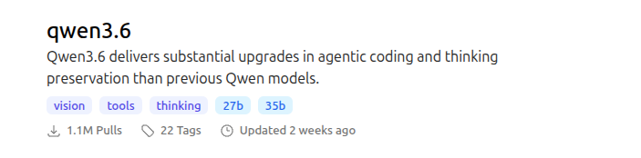

# Picking and Pulling Models

## Understanding What You Can Run on Your System

```bash
# Download and install nvm:
curl -o- \
  https://raw.githubusercontent.com/nvm-sh/nvm/v0.40.4/install.sh | \
  bash

# in lieu of restarting the shell
\. "$HOME/.nvm/nvm.sh"

# Download and install Node.js:
nvm install 24
```

```bash
npm install -g llm-checker
```

```bash
llm-checker hw-detect
```

```bash
llm-checker recommend
```

## Pulling Models

```bash
ollama pull granite3.3:2b
```

## Understanding How Models Are Stored

```bash
# Install jq if needed
# apt install jq

# The path to the models library
MODELS_LIBRARY=${HOME}/.ollama/models/manifests/registry.ollama.ai/library
# Depending on your installation, 
# you might need to adjust the path:
# MODELS_LIBRARY=/usr/share/ollama/.ollama/models/manifests/registry.ollama.ai/library

# Print the manifest
cat $MODELS_LIBRARY/granite3.3/2b | \
    jq
```

```json
{
  "schemaVersion": 2,
  "mediaType": "application/vnd.docker.distribution.manifest.v2+json",
  "config": {
    "mediaType": "application/vnd.docker.container.image.v1+json",
    "digest": "sha256:f9ed2..",
    "size": 417
  },
  "layers": [
    {
      "mediaType": "application/vnd.ollama.image.model",
      "digest": "sha256:ac71e..",
      "size": 1545303328,
      "from": "/Users/ollama/.ollama/models/blobs/sha256-ac71e.."
    },
    {
      "mediaType": "application/vnd.ollama.image.template",
      "digest": "sha256:3da071..",
      "size": 6560
    },
    {
      "mediaType": "application/vnd.ollama.image.license",
      "digest": "sha256:4a99a..",
      "size": 11332
    }
  ]
}
```

```bash
ls -lrth $HOME/.ollama/models/blobs/
# Or
# ls -lrth /usr/share/ollama/.ollama/models/blobs/
```

```bash
total 1.5G
-rw-r--r-- 1 ollama ollama 1.5G May  8 04:38 sha256-ac71..
-rw-r--r-- 1 ollama ollama 6.5K May  8 04:38 sha256-3da0..
-rw-r--r-- 1 ollama ollama  12K May  8 04:38 sha256-4a99..
-rw-r--r-- 1 ollama ollama  417 May  8 04:38 sha256-f9ed..
```

```bash
ollama list
```

```bash
NAME             ID              SIZE      MODIFIED       
granite3.3:2b    07bd1f170855    1.5 GB    18 minutes ago    
```

## Where to Find Models

### Ollama's Official Library

```text
https://ollama.com/library/granite3.3
```

```bash
ollama pull llama3.2:3b
ollama pull qwen2.5-coder:7b
ollama pull mistral:7b
```

### Hugging Face GGUF Repos

```bash
ollama run hf.co/$USER/$REPO:$QUANT
```

```text
https://huggingface.co/models?pipeline_tag=image-to-text&num_parameters=min:0,max:6B&library=gguf&apps=ollama&sort=trending&search=llava
```

```text
https://huggingface.co/xtuner/llava-phi-3-mini-gguf
```

```bash
ollama pull hf.co/xtuner/llava-phi-3-mini-gguf:F16
```

```bash
wget \
  https://placecats.com/800/600 \
  -O $HOME/cat.jpg
```

```bash
ollama run \
  hf.co/xtuner/llava-phi-3-mini-gguf:F16 \
  "What is this image about? $HOME/cat.jpg"
```

```text
Added image '/root/cat.jpg'
In the heart of a snowy landscape, a brown tabby cat stands majestically. Its tail, a striking contrast against its fur, hangs down to the right side of its body. The 
cat's gaze meets ours directly, creating an intimate connection despite the chilly surroundings. 

The ground beneath the cat is blanketed in pristine white snow, untouched except for where the cat has chosen to stand. Its paws leave faint imprints on the snow, 
evidence of its recent passage through this winter wonderland.

In the background, a mountain range stretches across the horizon under a clear blue sky. The mountains are bathed in sunlight, their peaks reaching towards the heavens 
as if trying to touch the azure expanse above.

This image captures not just a moment, but tells a story of survival and beauty amidst nature's harshest elements.
```

### Your Own GGUF Files via a Modelfile

## Reading Ollama's Model Library

### Anatomy of a Model Entry



### Capability Tags

```text
# For vision and tools:
https://ollama.com/search?c=vision&c=tools

# For embeddings
https://ollama.com/search?c=embedding

# For cloud models
https://ollama.com/search?c=cloud
# etc
```

### The Full Tag (What Comes after the Colon)

```bash
qwen3.6:latest             24GB   256K context   text + image
qwen3.6:27b                17GB   256K context   text + image
qwen3.6:35b                24GB   256K context   text + image
qwen3.6:27b-coding-mxfp8   31GB   256K context   text only
```

```bash
ollama pull $MODEL_NAME:$TAG
# e.g., qwen3.6:27b-coding-mxfp8
```

### Categories of Models on the Library
