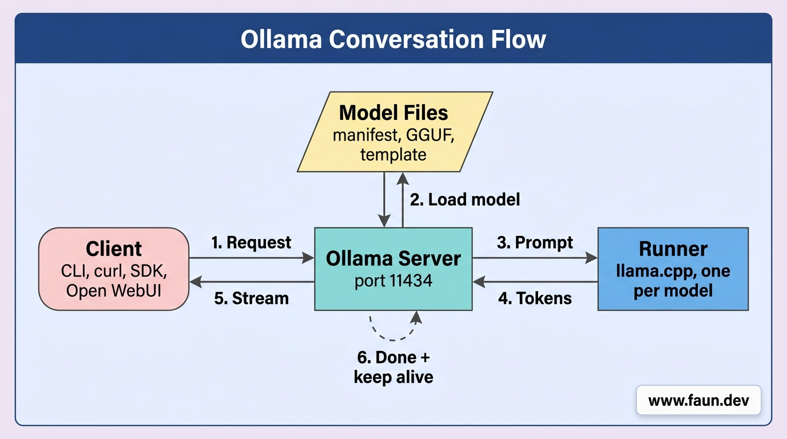

# Running Models and Understanding How They Work inside Ollama

## Running a Model

```bash
ollama run granite3.3:2b
```

```text
>>> Who's the creator of the Linux kernel?
Linus Torvalds

>>> What did I just ask you?
You asked me who the creator of the Linux kernel is.
```

```text
>>> What did I just ask you?
I don't have any record of previous interactions...
```

## One-Shot Mode

```bash
# Create a file with some text
cat > $HOME/article.txt <<EOF
The Linux kernel was created by Linus Torvalds in 2005 after he graduated from the University of Helsinki with a BSc in Computer Science. He started working on the project in 2006 and released the first version of the kernel in 2007. The kernel quickly gained popularity and was adopted by many Linux distributions, including Ubuntu, Fedora, and Debian.

In 2011, Torvalds released the first version of the Linux kernel with support for x86-64 architecture, which made it the first 64-bit kernel. He also released the first version of the Linux kernel with support for the ARM architecture, which made it the first kernel to support ARM-based devices.
EOF

# Run Ollama once to summarize the article

# 1st example
ollama run granite3.3:2b \
  "Summarize this in one sentence: $(cat $HOME/article.txt)"

# 2nd example
echo "Explain TCP handshake in 3 lines" | \
  ollama run granite3.3:2b

# 3rd example
ollama run granite3.3:2b \
  "$(free -m)\n Analyze my memory usage"
```

## Running Models with the Ollama API

### Prerequisites

```bash
curl http://localhost:11434/api/version
```

```json
{"version":"0.30.0"}
```

```bash
export MODEL="llama3.2:3b"
```

### /api/pull: Download a Model

```bash
curl http://localhost:11434/api/pull \
  -d "{\"model\": \"$MODEL\"}"
```

```text
{"status":"pulling manifest"}
{"status":"pulling dde5aa3fc5ff","digest":"sha256:...","total":2019377376}

// [... progress ...]

{"status":"verifying sha256 digest"}
{"status":"writing manifest"}
{"status":"success"}
```

```bash
curl http://localhost:11434/api/pull \
  -d "{\"model\": \"$MODEL\", \"stream\": false}"
```

### /api/generate: Single-Shot Completion

```bash
curl -s http://localhost:11434/api/generate -d "{
  \"model\": \"$MODEL\",
  \"prompt\": \"Explain what a transformer architecture is in two sentences.\",
  \"stream\": false
}" | jq
```

```json
{
  "model": "llama3.2:3b",
  "created_at": "2026-05-12T08:10:31.659858474Z",
  "response": "A transformer architecture is a type of neural network design that uses self-attention mechanisms to process sequential data, such as text or images...",
  "done": true,
  "done_reason": "stop",
  "context": [
    128006,
    // [... other tokens ...]
  ],
  "total_duration": 5946213748,
  "load_duration": 334729261,
  "prompt_eval_count": 37,
  "prompt_eval_duration": 91284365,
  "eval_count": 63,
  "eval_duration": 5389747128
}
```

```bash
curl http://localhost:11434/api/generate -d "{
  \"model\": \"$MODEL\",
  \"prompt\": \"List three reasons to run models locally.\"
}"
```

```text
{"model":"llama3.2:3b","created_at":"...","response":"Here","done":false}
{"model":"llama3.2:3b","created_at":"...","response":" are","done":false}
{"model":"llama3.2:3b","created_at":"...","response":" three","done":false}
{"model":"llama3.2:3b","created_at":"...","response":" reasons","done":false}
{"model":"llama3.2:3b","created_at":"...","response":" to","done":false}
{"model":"llama3.2:3b","created_at":"...","response":" run","done":false}
{"model":"llama3.2:3b","created_at":"...","response":" models","done":false}
{"model":"llama3.2:3b","created_at":"...","response":" locally","done":false}

// ...

{"model":"llama3.2:3b","created_at":"...","response":"","done":true,"total_duration":"..."}
```

```bash
curl -s http://localhost:11434/api/generate -d "{
  \"model\": \"$MODEL\",
  \"prompt\": \"List 3 reasons to run models locally.\"
}" | jq -j '.response'
```

```bash
curl -s http://localhost:11434/api/generate -d "{
  \"model\": \"$MODEL\",
  \"system\": \"You answer in exactly one sentence.\",
  \"prompt\": \"What is quantization?\",
  \"options\": {\"temperature\": 0.2, \"num_predict\": 80},
  \"stream\": false
}" | jq -j '.response'
```

### /api/chat: Multi-Turn Conversations

```bash
curl -s http://localhost:11434/api/chat -d "{
  \"model\": \"$MODEL\",
  \"messages\": [
    {\"role\": \"system\", \"content\": \"You are a terse Linux assistant. You answer in one sentence.\"},
    {\"role\": \"user\", \"content\": \"How do I find files larger than 100MB?\"}
  ],
  \"stream\": false
}" | jq
```

```json
{
  "model": "llama3.2:3b",
  "created_at": "2026-05-12T08:50:25.218995078Z",
  "message": {
    "role": "assistant",
    "content": "Use the `du` command with the `-h` option..."
  },
  "done": true,
  "done_reason": "stop",
  "total_duration": 4903948187,
  "load_duration": 217527548,
  "prompt_eval_count": 49,
  "prompt_eval_duration": 1006375804,
  "eval_count": 47,
  "eval_duration": 3584740159
}
```

#### Holding State

```python
import requests, os

URL = "http://localhost:11434/api/chat"
MODEL = os.environ["MODEL"]

# The full conversation lives here. Each turn appends to it, and we resend
# the whole list on every request since the server holds no session state.
messages: list[dict] = [
    {"role": "system", "content": "You are a terse Linux assistant."},
]

def ask(user_text: str) -> str:
    messages.append({"role": "user", "content": user_text})
    r = requests.post(URL, json={"model": MODEL, "messages": messages, "stream": False})
    r.raise_for_status()
    # The reply lives at message.content, not response.text like /api/generate.
    reply = r.json()["message"]["content"]
    # Append the assistant turn so the next call sees it as context.
    messages.append({"role": "assistant", "content": reply})
    return reply

# Second call works because "Now only in /var/log" only makes sense
# when the model can see the previous question about large files.
print(ask("How do I find files larger than 100MB?"))
print(ask("Now only in /var/log."))
```

#### The Context Window

```bash
curl -s http://localhost:11434/api/show \
  -d "{\"model\": \"$MODEL\"}" | \
  jq '.model_info | with_entries(select(.key | endswith("context_length")))'
```

```json
{
  "llama.context_length": 131072
}
```

```bash
# Load the model
curl -s http://localhost:11434/api/generate \
  -d "{\"model\": \"$MODEL\", \"prompt\": \"hi\", \"stream\": false}" \
  > /dev/null

# Get the size in RAM, VRAM and the context
curl -s http://localhost:11434/api/ps | \
  jq '.models[] | {name, size, size_vram, size_ram: (.size - .size_vram), context_length}'
```

```json
{
  "name": "llama3.2:3b",
  "size": 2481301504,
  "size_vram": 0,
  "size_ram": 2481301504,
  "context_length": 4096
}
```

```bash
curl -s http://localhost:11434/api/generate \
  -d "{\"model\": \"$MODEL\", \"prompt\": \"hi\", \"options\": {\"num_ctx\": 131072}, \"stream\": false}"
```

#### Images

```bash
# Download an image
wget \
  https://placecats.com/800/600 \
  -O $HOME/cat.jpg

# Encode the image
# The `-w0` flag disables line wrapping on Linux, on macOS use `base64 -i $HOME/cat.jpg`
IMAGE_B64=$(base64 -w0 $HOME/cat.jpg)

# Pull the model
curl http://localhost:11434/api/pull \
  -d "{\"model\": \"llava:7b\", \"stream\": false}"

# Build the payload in a file to avoid using long command lines
{
  printf '{"model":"llava:7b","stream":false,"messages":[{"role":"user","content":"What is in this image?","images":["'
  printf "$IMAGE_B64"
  printf '"]}]}'
} > /tmp/payload.json

# Verify the payload looks right
# cat /tmp/payload.json | jq

# Ask the model
curl -s http://localhost:11434/api/chat \
  -d @/tmp/payload.json | \
  jq -r '.message.content'
```

### generate vs chat: When to Use Which

## Ollama Conversation Flow


