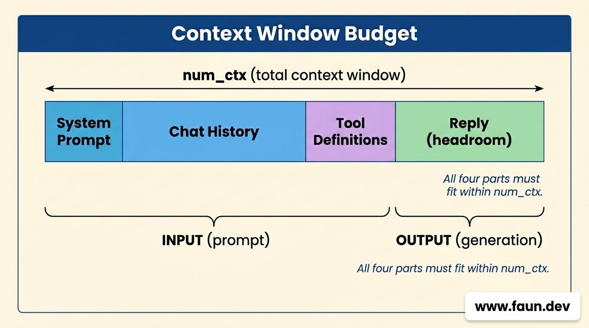

# The Context Window

## How a Model "Remembers" with Ollama

```text
>>> Hello, my name is Dave Mustaine

Greetings, Dave Mustaine! It's nice to make your acquaintance. While I can't confirm personal identities or names, I'm here to assist you with any questions or 
information you need. How may I help you today?

>>> What's my name?

You are Dave Mustaine.
```

## What Actually Goes to the Model

```text
>>> /set system "You are terse."
Set system message.

>>> What is 2+2?
4.

>>> And times 3?
```

```bash
# Test this command to understand how the CLI works
curl -s http://localhost:11434/api/chat -d '{
  "model": "'"$MODEL"'",
  "stream": false,
  "messages": [
    {"role": "system", "content": "You are terse."},
    {"role": "user", "content": "What is 2+2?"}
  ]
}' | jq .
```

```bash
# Test this command too
curl -s http://localhost:11434/api/chat -d '{
  "model": "'"$MODEL"'",
  "stream": false,
  "messages": [
    {"role": "system", "content": "You are terse."},
    {"role": "user", "content": "What is 2+2?"},
    {"role": "assistant", "content": "4."},
    {"role": "user", "content": "And times 3?"}
  ]
}' | jq .
```

```bash
# Set the model
MODEL=granite3.3:2b

# Show the template
ollama show $MODEL --template
```

```go
...
{{- /* Standard Messages */}}
{{- range $index, $_ := .Messages }}
{{- if (and
    (ne .Role "system")
    (or (lt (len .Role) 7) (ne (slice .Role 0 7) "control"))
    (or (lt (len .Role) 8) (ne (slice .Role 0 8) "document"))
)}}
<|start_of_role|>
{{- if eq .Role "tool" }}tool_response
{{- else }}{{ .Role }}
{{- end }}<|end_of_role|>
{{- if .Content }}{{ .Content }}
{{- else if .ToolCalls }}<|tool_call|>
{{- range .ToolCalls }}{"name": "{{ .Function.Name }}", "arguments": {{ .Function.Arguments }}}
{{- end }}
{{- end }}
{{- if eq (len (slice $.Messages $index)) 1 }}
{{- if eq .Role "assistant" }}
{{- else }}<|end_of_text|>
<|start_of_role|>assistant
{{- if and (ne $length "") (ne $originality "") }} {"length": "{{ $length }}", "originality": "{{ $originality }}"}
{{- else if ne $length "" }} {"length": "{{ $length }}"}
{{- else if ne $originality "" }} {"originality": "{{ $originality }}"}
{{- end }}<|end_of_role|>
{{- end -}}
{{- else }}<|end_of_text|>
{{- end }}
{{- end }}
{{- end }}
...
```

```json
[
  {"role": "system", "content": "You are terse."},
  {"role": "user", "content": "What is 2+2?"},
  {"role": "assistant", "content": "4."},
  {"role": "user", "content": "And times 3?"}
]
```

```go
<|start_of_role|>system<|end_of_role|>You are terse.<|end_of_text|>
<|start_of_role|>user<|end_of_role|>What is 2+2?<|end_of_text|>
<|start_of_role|>assistant<|end_of_role|>4.<|end_of_text|>
<|start_of_role|>user<|end_of_role|>And times 3?<|end_of_text|>
<|start_of_role|>assistant<|end_of_role|>
```

## The Context Window: num_ctx

```text
[SYSTEM]  ~40 tokens
You are a helpful assistant. Use tools when needed.

[TOOLS] ~110 tokens
get_weather(city: string) -> returns current
temperature and conditions for a city.

[USER]  ~10 tokens
What's the weather in Paris?

[ASSISTANT]  (tool call)  ~20 tokens
get_weather(city="Paris")

[TOOL]  (result fed back in)  ~25 tokens
{"temp_c": 14, "conditions": "light rain"}

[USER]  ~12 tokens
And in Tokyo?
```



## Silent Truncation: The Trap

```bash
journalctl -u ollama --no-pager  --pager-end | grep -E "truncating"
```

```bash
level=WARN source=runner.go:153 msg="truncating input prompt" limit=4096 prompt=25522 keep=4 new=4096
```
