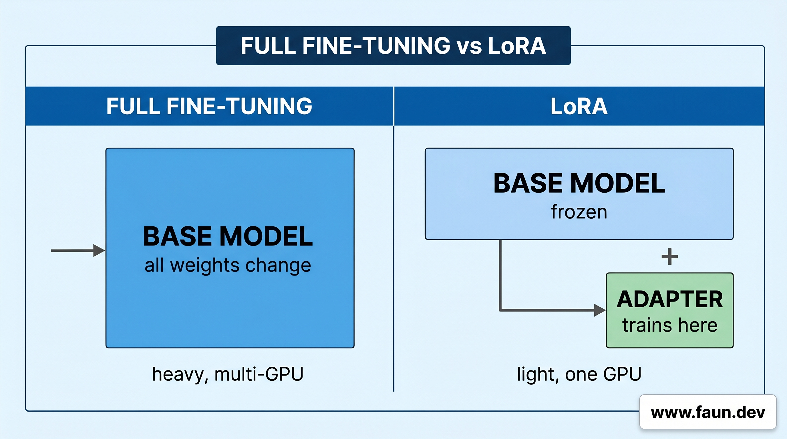
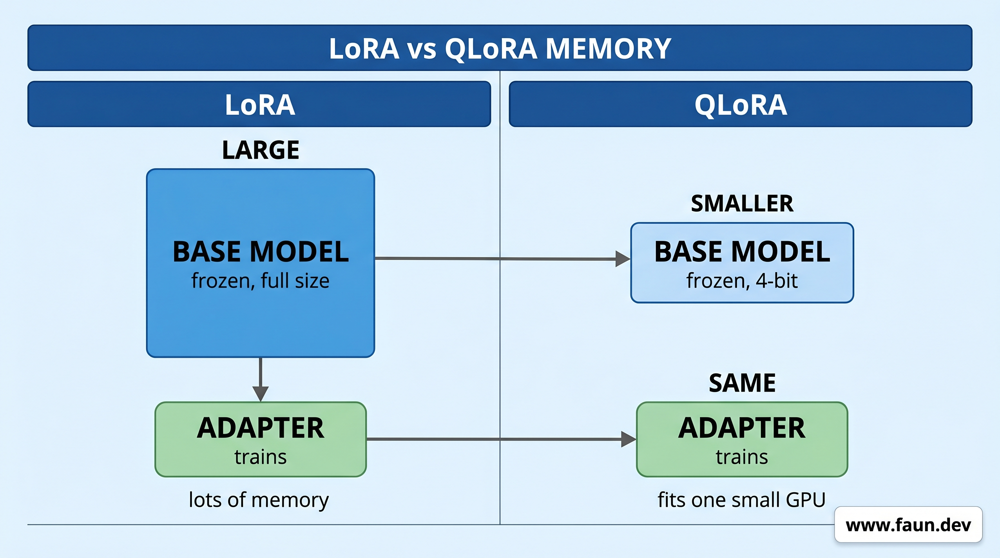
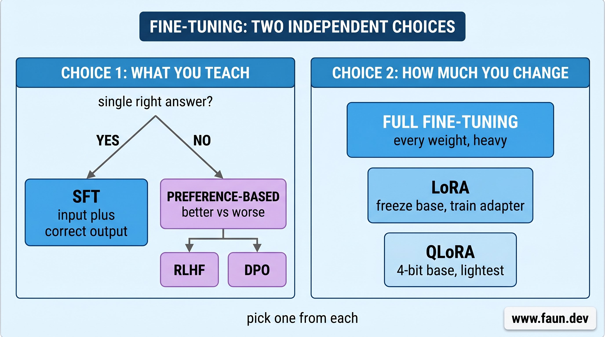
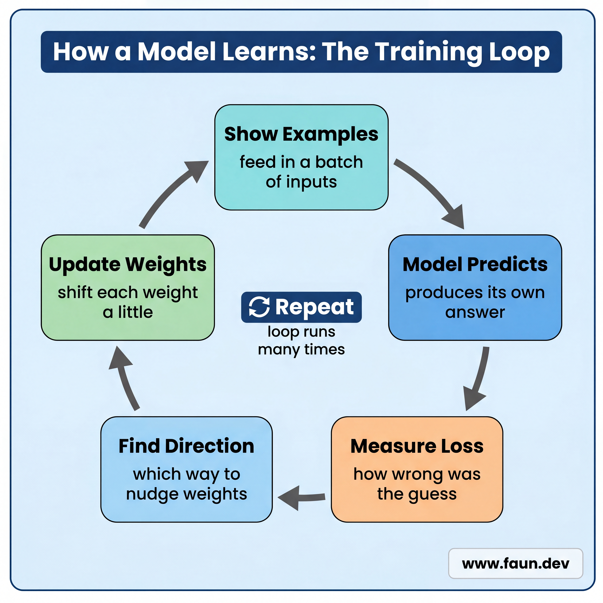

# Creating a Fine-Tuned Model (English to SQL)

## Why Fine-Tune

```Dockerfile
FROM granite4.1:3b  

# [...truncated...]

MESSAGE user added a retry with backoff to the HTTP client and a test for it

MESSAGE assistant feat(http): add retry with backoff to client

MESSAGE user fixed a typo in the README install section

MESSAGE assistant docs(readme): fix typo in install section

MESSAGE user renamed getUser to fetchUser across the codebase, no behavior change

MESSAGE assistant refactor: rename getUser to fetchUser
```

## How Fine-Tuning Works

### LoRA (Low-Rank Adaptation)



### QLoRA (Quantized Low-Rank Adaptation)



### What You Teach: Correct Answers vs Preferences



### The Dataset

```text
{
    "input": "How many users signed up in May?",
    "output": "SELECT COUNT(*) FROM users WHERE signup_month = 'May';"
}
{
    "input": "List all products under $20.",
    "output": "SELECT name FROM products WHERE price < 20;"
}
```

## Base Models vs Instruct Models

## Fine-Tuning the Model

### Step 1: Clone the Repo and Install Unsloth

```bash
# Install git
apt update && apt install git -y

# Install uv if needed
curl -LsSf https://astral.sh/uv/0.11.13/install.sh | sh \
    && source $HOME/.local/bin/env 

# Clone the repo
git clone \
    https://github.com/eon01/LocalAIEngineeringWithOllamaCompanionToolkit.git \
    $HOME/companion/

# Change directory
cd $HOME/companion/code/finetuning

# Install packages from the lockfile
uv sync
```

### Step 2: Load the Base Model in 4-Bit

#### Where the Model Comes From

#### Which Model We Use

```python
from unsloth import FastLanguageModel

# How long each training example can be, in tokens.
# A SQL schema plus a question fits comfortably in 2048.
max_seq_length = 2048

model, tokenizer = FastLanguageModel.from_pretrained(
    model_name = "unsloth/granite-4.0-micro",
    max_seq_length = max_seq_length,
    load_in_4bit = True,   # load the compressed 4-bit form (the QLoRA part)
)
```

### Step 3: Attach the LoRA Adapter

```python
model = FastLanguageModel.get_peft_model(
    model,
    r = 16,                # adapter size
    lora_alpha = 16,       # adapter strength
    lora_dropout = 0,
    bias = "none",
    target_modules = [     # where the adapter attaches (leave as-is)
        "q_proj",
        "k_proj",
        "v_proj",
        "o_proj",
        "gate_proj",
        "up_proj",
        "down_proj",
    ],
    use_gradient_checkpointing = "unsloth",  # saves memory during training
    random_state = 3407,                     # makes the run repeatable
)
```

### Step 4: Load the Dataset

```python
from datasets import load_dataset

dataset = load_dataset(
    "gretelai/synthetic_text_to_sql",
    split = "train[:5000]",
)

# Confirm the column names before mapping them. A renamed column
# is a silent break, so check the real data once.
print(dataset.column_names)
print(dataset[0])
```

### Step 5: Format Each Row into Granite's Chat Format

```python
# A fixed instruction. The schema and question change per row,
# so they go in the user turn, not here.
SYSTEM = ("You translate questions into SQL for the given schema. "
          "Reply with one SQL query and nothing else.")

def format_example(row):
    messages = [
        {"role": "system", "content": SYSTEM},
        {"role": "user", "content":
            f"Schema:\n{row['sql_context']}\n\nQuestion: {row['sql_prompt']}"},
        {"role": "assistant", "content": row["sql"]},
    ]

    # tokenize=False returns plain text; the trainer tokenizes later.
    text = tokenizer.apply_chat_template(messages, tokenize=False)
    
    return {"text": text}

# Turn every row into a single "text" field the trainer reads.
dataset = dataset.map(format_example)

# Look at one formatted row to see the template Granite expects.
print(dataset[0]["text"])
```

### Step 6: Set Up the Trainer

```python
from trl import SFTTrainer, SFTConfig

trainer = SFTTrainer(
    model = model,
    tokenizer = tokenizer,
    train_dataset = dataset,
    args = SFTConfig(
        dataset_text_field = "text",
        per_device_train_batch_size = 2,
        gradient_accumulation_steps = 4,
        warmup_steps = 5,
        num_train_epochs = 1,
        learning_rate = 2e-4,
        logging_steps = 10,
        optim = "adamw_8bit",
        weight_decay = 0.001,
        lr_scheduler_type = "linear",
        seed = 3407,
        output_dir = "outputs",
        report_to = "none",
    ),
)
```

### Step 7: Train Only on the Answers

```python
from unsloth.chat_templates import train_on_responses_only

# The role markers are Granite-specific; they mark where the
# user turn ends and the assistant answer begins.
trainer = train_on_responses_only(
    trainer,
    instruction_part = "<|start_of_role|>user<|end_of_role|>",
    response_part = "<|start_of_role|>assistant<|end_of_role|>",
)
```

### Step 8: Train

```python
trainer.train()
```

### Step 9: Save the Adapter

```python
model.save_pretrained("granite_sql_lora")
tokenizer.save_pretrained("granite_sql_lora")
```

### Step 10: Run the Script

```bash
# Change directory
cd $HOME/companion/code/finetuning

# Run the training
uv run train.py
```

```text
Trainable parameters = 10,485,760 of 3,413,322,240 (0.31% trained)
```

```text
// Start of output
{'loss': '1.489', 'grad_norm': '1.86', 'learning_rate': '0.0001987', 'epoch': '0.016'}    

// ...

{'loss': '0.1913', 'grad_norm': '0.3889', 'learning_rate': '7.613e-05', 'epoch': '0.624'}    
{'loss': '0.1888', 'grad_norm': '0.5175', 'learning_rate': '7.29e-05', 'epoch': '0.64'}      
{'loss': '0.2269', 'grad_norm': '0.49', 'learning_rate': '6.968e-05', 'epoch': '0.656'}      
{'loss': '0.1655', 'grad_norm': '0.4111', 'learning_rate': '6.645e-05', 'epoch': '0.672'}    

// ...   

// End of output
{'loss': '0.1419', 'grad_norm': '0.5048', 'learning_rate': '1.935e-06', 'epoch': '0.992'} 
```

## Understanding What Happened



## Fine-Tuning in the Browser with Unsloth Studio

### Install Studio

```bash
# Clone the repo
git clone \
    https://github.com/unslothai/unsloth.git

# Change directory
cd unsloth

# Checkout the release
git checkout v0.1.44-beta

# Install
./install.sh --local
```

### Start the Server

```bash
# Start the server
unsloth studio -H 0.0.0.0 -p 8888
```

### Open It in Your Browser

```text
http://IP_ADDRESS:8888
```

```bash
ssh -p <ssh-port> <user>@<ip> -L 8888:localhost:8888 -N
```

```text
http://localhost:8888
```
