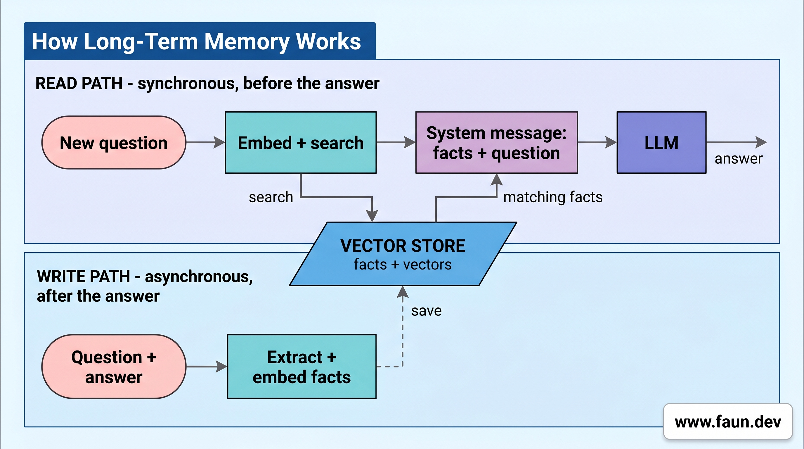

# Building Advanced Agents: Long-Term Memory with mem0

## Pass 7: Give the Chat a Long-Term Memory That Survives Restarts



### Step 1: Add the Memory Settings

```python
# repl/config.py

# Model used by mem0 to extract durable facts from conversations.
# Needs to be smart enough to distinguish "the user said X" from
# generic assistant text. A 2B model is too small for reliable
# extraction; 3B is the practical minimum.
EXTRACTION_MODEL: str = os.environ.get(
    "EXTRACTION_MODEL", "granite3.3:8b"
)

# Model used to turn text into vectors for similarity search.
EMBED_MODEL: str = os.environ.get(
    "EMBED_MODEL", "nomic-embed-text:v1.5"
)

# Collection name inside Chroma. One collection per app is fine.
COLLECTION_NAME: str = os.environ.get(
    "COLLECTION_NAME", "my_memories"
)

# Where mem0 keeps its vector store on disk. Survives restarts.
# Delete this directory to wipe all memories and start fresh.
MEMORY_DB_PATH: str = os.path.expanduser(
    os.environ.get("MEMORY_DB_PATH", "/var/data/ollama")
)

# Maximum cosine distance (Chroma raw, lower = more similar) for a memory
# to be considered relevant to the current query. mem0's own `threshold`
# is unusable - its normalized score saturates at 1.0 for irrelevant
# content. With nomic-embed-text:v1.5, relevant matches sit below ~1.0
# and noise sits above ~1.2. Lower this to be stricter.
MEMORY_RELEVANCE_THRESHOLD: float = float(
    os.environ.get("MEMORY_RELEVANCE_THRESHOLD", "1.0")
)

# When true, print extra diagnostic lines (e.g. memory write lifecycle).
# Errors are always shown regardless of this flag.
DEBUG: bool = os.environ.get("DEBUG", "false").lower() in {
    "1",
    "true",
    "yes",
    "on",
}
```

### Step 2: Build the Memory Object

```python
def build_memory() -> Memory:
    """Set up mem0. Everything runs locally, no cloud services.

    mem0 needs three pieces:
      - llm: extracts the durable facts from a conversation.
      - embedder: turns text into vectors (lists of numbers) so we
        can find facts that look similar to the user's question.
      - vector_store: where the facts and their vectors live on disk.
    """
    config = {
        "llm": {
            "provider": "ollama",
            "config": {
                "model": EXTRACTION_MODEL,
                "ollama_base_url": OLLAMA_HOST,
            },
        },
        "embedder": {
            "provider": "ollama",
            "config": {
                "model": EMBED_MODEL,
                "ollama_base_url": OLLAMA_HOST,
            },
        },
        "vector_store": {
            "provider": "chroma",
            "config": {
                "collection_name": COLLECTION_NAME,
                "path": MEMORY_DB_PATH,
            },
        },
    }
    return Memory.from_config(config)
```

### Step 3: Identify the User at Startup

```python
USER_ID = (
    input("Enter your user id: ").strip() or "default"
)
```

### Step 4: Look Up Relevant Facts before Answering

```python
# Step 1: turn the user's question into a vector (a list of
# numbers) using the same embedding model mem0 used when storing
# facts. Same model = comparable vectors.
embedding = memory.embedding_model.embed(
    query, memory_action="search"
)
```

```python
# Step 2: ask Chroma for the closest stored facts. We ask for
# k*4 candidates so we have spares after filtering by distance.
# `where` restricts the search to this user only.
res = memory.vector_store.collection.query(
    query_embeddings=[embedding],
    n_results=k * 4,
    where={"user_id": user_id},
)
```

```python
# Chroma returns lists of lists (one inner list per query). We
# only ran one query, so we grab the [0] inner list.
distances = res.get("distances", [[]])[0]
metadatas = res.get("metadatas", [[]])[0]

# Step 3: walk through the candidates from closest to farthest,
# keep up to `k` that pass our relevance threshold.
facts: list[str] = []
for dist, meta in zip(distances, metadatas):
    # SMALL distance = similar meaning. If a candidate is farther
    # than the threshold, it's not really related to the question.
    if dist >= MEMORY_RELEVANCE_THRESHOLD:
        continue
    # The actual fact text is stored in the metadata's "data" key.
    text = meta.get("data", "")
    if text:
        facts.append(text)
    # Got enough relevant facts, stop early.
    if len(facts) >= k:
        break
```

### Step 5: Write to Memory in the Background

```python
def write_memory_async(
    memory: Memory, user_text: str, reply: str
) -> None:
    """Save the turn to long-term memory WITHOUT blocking the chat.

    mem0.add() can take a few seconds (it calls the model to extract
    facts). To keep the REPL snappy, we kick off the save in a
    background thread and let the user keep typing.
    """

    def _run() -> None:
        try:
            if DEBUG:
                print(
                    "\nMemory write started...", flush=True
                )
            memory.add(
                messages=[
                    {"role": "user", "content": user_text},
                    {"role": "assistant", "content": reply},
                ],
                user_id=USER_ID,
                infer=True,
            )
            if DEBUG:
                print(
                    "\nMemory write complete.", flush=True
                )
        except Exception as e:
            print(
                f"\n(memory write failed: {e})", flush=True
            )

    t = threading.Thread(target=_run, daemon=True)
    t.start()
    _write_threads.append(t)
```

### Step 6: Inject the Memory Block at the Top of Each Turn

```python
# Look up relevant facts for THIS question and pass them to
# the model as a system message (background context).
memory_block = relevant_memories(
    memory, query=user, user_id=USER_ID
)


messages: list = []
if memory_block:
    messages.append(
        SystemMessage(content=memory_block)
    )
messages.append(HumanMessage(content=user))
```

### Step 7: Save the Turn (Skip Empty Replies)

```python
if full_reply.strip():
    write_memory_async(memory, user, full_reply)
```

### Step 8: Wait for Pending Writes on `/bye`

```python
if user.strip() == "/bye":
    pending = [
        t for t in _write_threads if t.is_alive()
    ]
    if pending:
        print(
            f"Waiting for {len(pending)} memory write(s) to finish..."
        )
        for t in pending:
            t.join()
    break
```

### Step 9: Run the REPL

```bash
# Create the data directory
sudo mkdir -p /var/data/ollama

# Make sure it's owned by the current user
sudo chown -R $USER /var/data/ollama

# Make sure it's writable
sudo chmod -R u+rwX /var/data/ollama
```

```bash
# Pull the required models if not already present
# ollama pull <your model>

# Change directory
cd $HOME/companion/code/repl

# Run the REPL
uv run pass_7_repl_with_memory.py
```
