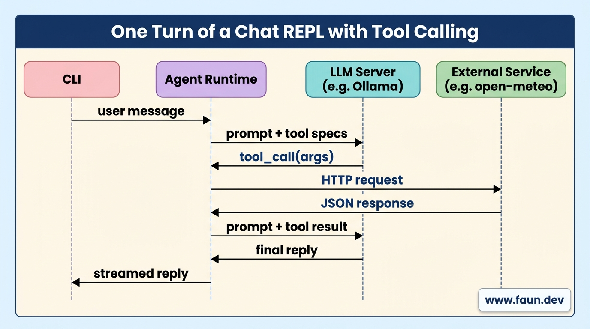

# Building Advanced Agents: Function-Calling

## Pass 8: Let the Model Call Python Functions ("Tools") to Fetch Live Data

```python
agent = create_agent(
    model=llm,    
    middleware=[
        SummarizationMiddleware(
            model=summarizer,
            trigger=("tokens", 2000),
            keep=("messages", 6),
        ),
    ],
)
```

## The Shape of a Tool Call, End to End

```python
# repl/test_agent.py
from langchain_core.tools import tool
from langchain.agents import create_agent
from langchain_ollama import ChatOllama


@tool
def add_numbers(a: int, b: int) -> int:
    """Add two integers and return the result."""
    # Debugging
    print("I'm being called with", a, b)  
    return a + b


llm = ChatOllama(
        model="granite3.3:2b", 
        base_url="http://localhost:11434"
    )
agent = create_agent(model=llm, tools=[add_numbers])

response = agent.invoke(
    {
        "messages": 
        [
            {
                "role": "user", 
                "content": "What is 17 plus 25?"
            }
        ]
    }
)
print(response["messages"][-1].content)
```

```bash
# Change directory
cd $HOME/companion/code/repl

# Run the agent
uv run test_agent.py 

# Output:
# I'm being called with 17 25
# The sum of 17 and 25 is 42.
```

### Step 1: Write a Private Helper for Geocoding

```python
def _get_coordinates(location: str) -> tuple[float, float]:
    response = httpx.get(
        "https://geocoding-api.open-meteo.com/v1/search",
        params={
            "name": location,
            "count": 1,
            ...
        },
        timeout=10,
    )
    response.raise_for_status()
    ...
```

### Step 2: Define Real Tools with `@tool`

```python
@tool
def get_air_quality(location: str) -> str:
    """Get current air quality (PM10 and PM2.5) for a named location."""
    if DEBUG:
        print(f"Tool called: get_air_quality({location})")
    latitude, longitude = _get_coordinates(location)
    response = httpx.get(
        "https://air-quality-api.open-meteo.com/v1/air-quality",
        params={
            "latitude": latitude,
            "longitude": longitude,
            "hourly": "pm10,pm2_5",
            "forecast_days": 1,
        },
        timeout=10,
    )
    response.raise_for_status()
    data = response.json()
    if (
        "hourly" in data
        and "pm10" in data["hourly"]
        and "pm2_5" in data["hourly"]
    ):
        pm10 = data["hourly"]["pm10"][
            0
        ]  # [0] = current hour
        pm2_5 = data["hourly"]["pm2_5"][0]
        result = f"PM10: {pm10} μg/m³, PM2.5: {pm2_5} μg/m³"
    else:
        result = "Air quality data not available"
    return f"Air quality in {location}: {result}"
```

```python
@tool
def get_temperature(location: str) -> str:
    """Get the current temperature in Celsius for a named location."""
    if DEBUG:
        print(f"Tool called: get_temperature({location})")
    latitude, longitude = _get_coordinates(location)
    response = httpx.get(
        "https://api.open-meteo.com/v1/forecast",
        params={
            "latitude": latitude,
            "longitude": longitude,
            "hourly": "temperature_2m",
            "forecast_days": 1,
        },
        timeout=10,
    )
    response.raise_for_status()
    data = response.json()
    if (
        "hourly" in data
        and "temperature_2m" in data["hourly"]
    ):
        temperature = data["hourly"]["temperature_2m"][
            0
        ]  # [0] = current hour
        result = f"Temperature: {temperature} °C"
    else:
        result = "Temperature data not available"
    return f"Temperature in {location}: {result}"
```

```python
# The list of tools we hand to the agent. Add new ones here and the
# model will automatically see them.
TOOLS = [get_air_quality, get_temperature]
```

### Step 3: Add an Anti-Hallucination System Prompt

```python
# Without this, when a tool fails, models often "fill in" with made-up
# data ("typical temperature is about 20 °C"). That's worse than no
# answer. This system message tells the model to admit it doesn't know.
NO_FABRICATION = (
    "When a tool fails, tell the user the data is unavailable and stop. "
    "NEVER fabricate numbers, fall back to 'typical' values, or guess. "
    "It is better to say you don't know than to invent data."
)
```

### Step 4: Wire Tools and a Retry Middleware into the Agent

```python
# The agent now has tools wired in. On every turn it can:
#   1. answer right away, OR
#   2. call one of our tools, read the result, then answer.
# That decision happens inside the agent loop.
agent = create_agent(
    model=llm,
    tools=TOOLS,
    middleware=[
        # When a tool raises an exception (network down, bad args,
        # etc.), don't crash. Instead, send the error TEXT back to
        # the model as the tool result so the model can apologise
        # or try a different approach.
        ToolRetryMiddleware(
            max_retries=0, on_failure="continue"
        ),
        SummarizationMiddleware(
            model=summarizer,
            trigger=("tokens", 2000),
            keep=("messages", 6),
        ),
    ],
)
```

### Step 5: Prepend the Anti-Hallucination Message

```python
messages: list = [
    SystemMessage(content=NO_FABRICATION)
]
if memory_block:
    messages.append(
        SystemMessage(content=memory_block)
    )
messages.append(HumanMessage(content=user))
```

### Step 6: Run the REPL

```bash
# Change directory
cd $HOME/companion/code/repl/

# Run the REPL
uv run pass_8_repl_with_tools.py
```

```text
> What's the weather in paris?

Temperature in Paris: Temperature: 15.1 °C

> What's the air quality there?

The air quality in Paris currently is as follows:
- PM10: 8.8 μg/m³
- PM2.5: 3.6 μg/m³
```


