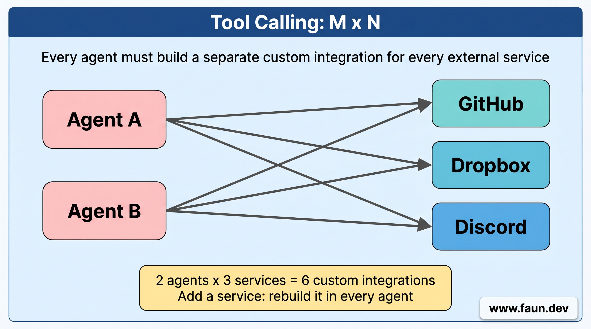
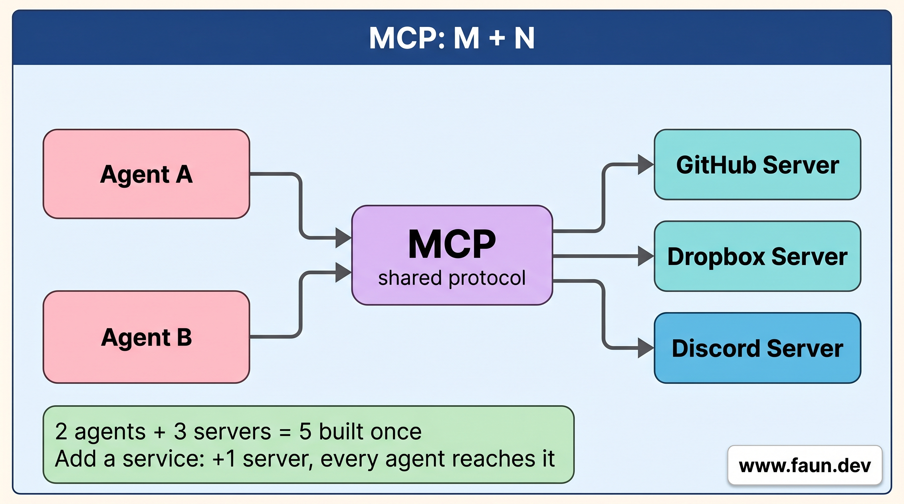
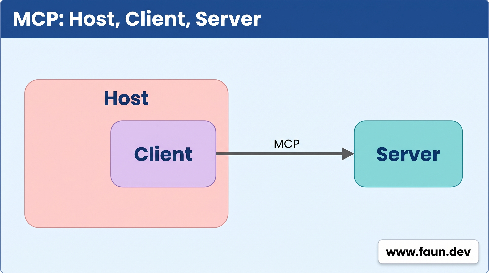

# Building Advanced Agents: Integrating MCP Servers







## LangChain and MCP

```toml
[project]
name = "repl"
version = "0.1.0"
description = "Add your description here"
readme = "README.md"
requires-python = ">=3.12"
dependencies = [
    "chromadb==1.5.9",
    "langchain==1.2.18",
    "langchain-core==1.4.0",
    "langchain-mcp-adapters==0.2.2",
    "langchain-ollama==1.1.0",
    "langchain-redis==0.2.5",
    "mem0ai[nlp]==2.0.0",
    "ollama==0.6.2",
    "python-dotenv==1.2.2",
]
# [.. truncated ..]
```

```python
async def main():
    client = MultiServerMCPClient(
        {
            "math": {
                "transport": "stdio",  # Local subprocess communication
                "command": "python",
                # Absolute path to your math_server.py file
                "args": ["/path/to/math_server.py"],
            },
            "weather": {
                "transport": "http",  # HTTP-based remote server
                # Ensure you start your weather server on port 8000
                "url": "http://localhost:8000/mcp",
            }
        }
    )

    tools = await client.get_tools()
    agent = create_agent(
        "claude-sonnet-4-6",
        tools  
    )
    response = await agent.run("What is the weather in New York City?")
    print(response)
```

## Pass 9: Get Tools from an External MCP Server Instead of Writing Them In-Process

### Step 1: Start the MCP Server

```bash
# Download and install nvm:
curl -o- \
    https://raw.githubusercontent.com/nvm-sh/nvm/v0.40.4/install.sh | \
    bash

# in lieu of restarting the shell
\. "$HOME/.nvm/nvm.sh"

# Download and install Node.js:
nvm install 24

# Install Open-Meteo MCP Server
npm install -g open-meteo-mcp-server@1.6.1

# Start the server
TRANSPORT=http PORT=3000 npx open-meteo-mcp-server
```

### Step 2: Add the MCP Settings to `config.py`

```python
# config.py
MCP_SERVER_URL: str = os.environ.get(
    "OPEN_METEO_MCP_URL", "http://localhost:3000/mcp"
)

ALLOWED_TOOLS: set[str] = {
    name.strip()
    for name in os.environ.get(
        "ALLOWED_TOOLS",
        "geocoding,weather_forecast,air_quality",
    ).split(",")
    if name.strip()
}

TOOL_GUIDANCE: str = os.environ.get(
    "TOOL_GUIDANCE",
    "You have access to weather tools that require latitude and longitude. "
    "When the user names a place, first call the `geocoding` tool with that "
    "name, take the latitude/longitude from the first result, and then call "
    "the relevant weather tool (e.g. `weather_forecast`, `air_quality`) "
    "with ONLY the `latitude` and `longitude` arguments..."
    "Report the answer in plain English.",
)
```

### Step 3: Connect to the Server and Fetch Tools

```python
async def load_mcp_tools() -> list:
    """Connect to the MCP server and grab its tools.

    The server advertises a list of tools it provides. The MCP
    adapter wraps each one so LangChain treats them just like the
    local @tool functions from pass 8, the rest of the code doesn't
    know the difference.

    We then filter to ALLOWED_TOOLS so small models don't get
    overwhelmed by every tool the server offers.
    """
    client = MultiServerMCPClient(
        {
            "open-meteo": {
                "url": MCP_SERVER_URL,
                "transport": "streamable_http",
            }
        }
    )
    tools = await client.get_tools()
    return [t for t in tools if t.name in ALLOWED_TOOLS]
```

### Step 4: Make `main` Async

```python
async def main() -> None:
    global USER_ID
    USER_ID = (
        input("Enter your user id: ").strip() or "default"
    )

    llm = ChatOllama(
        model=OLLAMA_MODEL,
        base_url=OLLAMA_HOST,
        num_predict=2048,
    )
    summarizer = ChatOllama(
        model=OLLAMA_MODEL,
        base_url=OLLAMA_HOST,
        num_predict=2048,
    )

    # Reach out to the MCP server NOW (rather than waiting until the
    # first user question) so we fail fast if it isn't running.
    print(
        f"Connecting to MCP server at {MCP_SERVER_URL}..."
    )
    tools = await load_mcp_tools()

    # [... trimmed code for brevity ...]

if __name__ == "__main__":
    asyncio.run(main())
```

### Step 5: `input()` from inside Async Code

```python
user = await asyncio.to_thread(read_input)
```

### Step 6: Wire the Network-Fetched Tools into the Agent

```python
# Same agent setup as pass 8, but `tools` came from the network
# rather than being defined in this file.
agent = create_agent(
    model=llm,
    tools=tools,
    middleware=[
        ToolRetryMiddleware(
            max_retries=0, on_failure="continue"
        ),
        SummarizationMiddleware(
            model=summarizer,
            trigger=("tokens", 2000),
            keep=("messages", 6),
        ),
    ],
)
```

### Step 7: Prepend `TOOL_GUIDANCE` to Each Turn's Messages

```python
messages: list = [
    SystemMessage(content=TOOL_GUIDANCE),
    SystemMessage(content=NO_FABRICATION),
]
if memory_block:
    messages.append(
        SystemMessage(content=memory_block)
    )
messages.append(HumanMessage(content=user))
```

### Step 8: Use the Async Stream

```python
async for chunk, meta in agent.astream(
    {"messages": messages},
    stream_mode="messages",
):

    # Behind the scenes the agent uses two models: the main
    # chat model AND the summarizer. Both stream their text
    # through here. We only want to print the main one, so we
    # check the chunk's source node ("model" = main reply).
    if meta.get("langgraph_node") != "model":
        continue
    if (
        isinstance(chunk, AIMessage)
        and chunk.content
    ):
        print(chunk.content, end="", flush=True)
        full_reply += chunk.content
```

### Step 9: Run the REPL

```bash
# Change directory
cd $HOME/companion/code/repl

# Run the REPL
uv run pass_9_repl_with_mcp.py
```

```text
// After running: TRANSPORT=http PORT=3000 npx open-meteo-mcp-server

// Server startup
{"timestamp":"..","level":"info","event":"server_start","transport":"http","port":3000}

// Session initialization
{"timestamp":"..","level":"info","event":"http_request","method":"initialize","session_id":null,"remote_ip":"127.0.0.1","user_agent":".."}
{"timestamp":"..","level":"info","event":"session_created","session_id":".."}
{"timestamp":"..","level":"info","event":"session_initialized","session_id":".."}

// Tool discovery
{"timestamp":"..","level":"info","event":"http_request","method":"tools/list","session_id":"..","remote_ip":"127.0.0.1","user_agent":".."}

//...
```

```text
> Hey there, what are the tools you have access to?
  
I can help you find weather forecasts, air quality data, and more by using geographic coordinates. First, I'll need to know the location you're interested in. Could you please provide a place name or postal code? For example, if you want to check the weather in Paris, France, we would start by finding its latitude and longitude.

> What's the weeather in Tokyo?
  
The current weather in Tokyo is 16.2°C with a relative humidity of 80%. The wind speed is approximately 3.6 km/h, and the sky is mainly clear.
```

```text
//...

// The call to the geocoding tool to get lat/lon
{"timestamp":"..","level":"info","event":"tool_call","tool":"geocoding","args":{"name":"Tokyo, Japan"}}

// The response from the geocoding tool
{"timestamp":"..","level":"info","event":"tool_success","tool":"geocoding","response_size":2433,"duration_ms":217}

// [... trimmed code for brevity ...]

// The call to the weather_forecast tool
{"timestamp":"..","level":"info","event":"tool_call","tool":"weather_forecast","args":{"current":["temperature_2m","relative_humidity_2m","weather_code","wind_speed_10m"],"latitude":35.6895,"longitude":139.69171}}

// The response from the weather_forecast tool
{"timestamp":"..","level":"info","event":"tool_success","tool":"weather_forecast","response_size":572,"duration_ms":704}

//...
```
