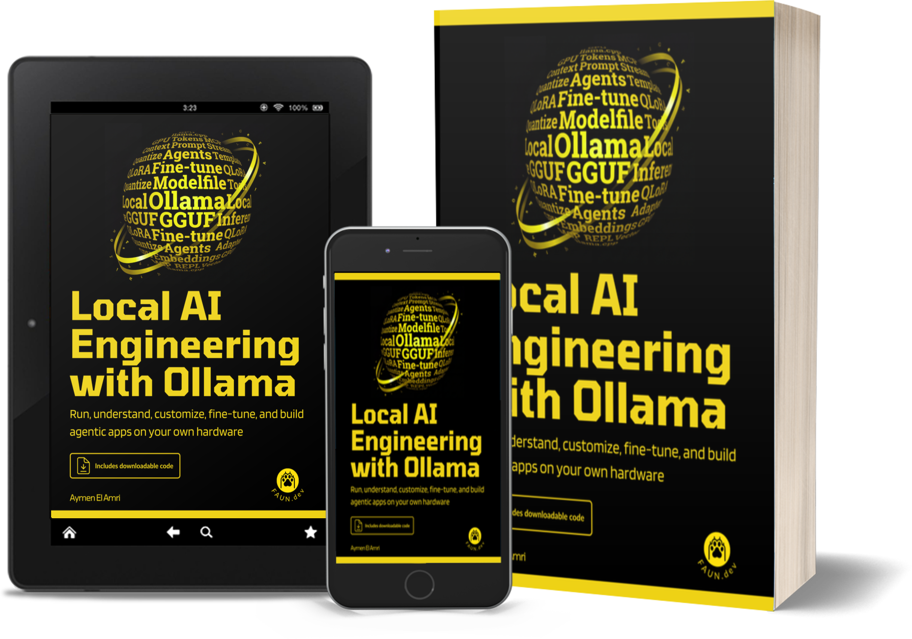

# Local AI Engineering with Ollama

**Run, understand, customize, fine-tune, and build agentic apps on your own hardware.**

## Why This Book Exists

Most people will only ever rent intelligence. They type into a box, a bill runs in the background, and the model that answers them lives on hardware they will never see, owned by a company that can change the price, the rules, or the model itself whenever it wants. That is the default now. I think it is a bad default.

This is not a theoretical risk. In August 2025, OpenAI retired GPT-4o overnight and pushed everyone onto GPT-5. People who had built their daily work around a fast, predictable model woke up to one that was slower and behaved differently, with no way to go back. In June 2026, a US government export control directive forced Anthropic to cut off Fable 5 and Mythos 5 for every customer at once, citing national security. Teams that had started building on those models lost them in an afternoon, for reasons that had nothing to do with their own work. None of these people did anything wrong. They just did not own what they depended on, so the model, the price, and the rules stayed in someone else's hands, and any of them could move without warning.

This book exists because I got tired of that arrangement. I wanted to own the thing that runs: take a model apart, change how it behaves, feed it my own data, and break it without a meter running. The first time a model answered me from my own machine, with the network unplugged, something clicked. It was mine. It would still be mine next year. The vendor could not revoke my access, change the terms, or deprecate the model out from under me. The limit was my own: I can run any model I want, when I want, where I want, and most importantly, how I want.

What surprised me was how few people knew this was possible, and how much of what little they could find was either a marketing page or a research paper. Almost nothing existed for the person in the middle: the developer who can read code and run commands but has no machine learning degree and wants none. So I wrote the book I needed when I started.

This is a practical book. You will not find history lessons or grand claims about the future. You will find things that run. By the end, three artifacts sit on your own disk: a model you customized to do one job the same way every time, a model you fine-tuned on your own data, and a chat application you built in nine passes until it became a tool-using agent. Every chapter leaves you with something working, because the only way to learn this is to make it work on your own hardware and watch it break in your own particular way.

It is also a tested book. Every command in it was run on a real machine, and every output you see, the JSON responses, the error messages, the token counts, the training logs, came from an actual session, not from documentation I trusted and pasted in. When Ollama behaved differently from its own docs, I say so and pin the version it happened on. When I could not verify a claim, I checked it against the source or cut it. The tooling moves fast enough that a confident guess is worse than no answer, so where accuracy and polish pulled apart, accuracy won. That is where the months went, and it is the part that ages well.

**Local AI Engineering with Ollama: Run, understand, customize, fine-tune, and build agentic apps on your own hardware** is a map crafted with a single purpose: to make local agentic AI a technology you control, not a service you submit to.

If you want to stop renting and start owning, this book is for you. Start at the first chapter, get a model running tonight, and keep going. The rest follows from there.

## What You Will Learn

This book moves in one direction: from running your first model to shipping an agent that runs on your own hardware. Each chapter ends with something working, and each skill below builds on the one before it. By the end you will be able to:

**Understand what a model is actually doing**: You will learn how text becomes tokens, how tokens become predictions, and what weights, embeddings, attention, and the KV cache really are. Just enough to make decisions, with every concept tied to a setting you will later change.

**Install Ollama and size your hardware honestly**: You will learn to install the runtime, tell whether a model fits in your RAM or VRAM before you download it, and read the tradeoffs between parameter count, quantization, and speed so you stop pulling models you will delete an hour later.

**Pick, pull, and manage models**: You will learn to read the Ollama library and Hugging Face GGUF repos, choose the right quantization (Q4_K_M, Q5_K_M, Q8_0, and the rest), and manage what is on disk and in memory with list, show, ps, stop, copy, and remove.

**Drive Ollama from its API**: You will move past the CLI and talk to Ollama the way your apps will, over HTTP, so anything you build (a script, a backend, an agent) can run models without a human typing commands. You will also learn to read tokens-per-second straight off the API so you can compare models and hardware on numbers, not vibes.

**Control the context window**: You will take control of how much your model remembers in a single conversation, so you can stop a model from silently forgetting the start of a long chat and start sizing the context window deliberately for the job at hand. You will also learn to see exactly what gets sent to the model on each turn, which is the difference between guessing why a model misbehaves and knowing.

**Operate a model under real conditions**: You will learn to tune behavior at runtime with temperature, top_p, top_k, penalties, and seed, control how long models stay loaded with keep-alive, and set concurrency so one model can serve parallel requests without falling over.

**Package a custom model with a Modelfile**: You will turn a general-purpose model into a customized one that does a specific job the same way every time, then ship it as a single named artifact a teammate can pull and run with zero setup.

**Fine-tune a model on your own data**: You will learn when prompting stops being enough and training begins, then fine-tune Granite to turn plain English into SQL using QLoRA with Unsloth, understand SFT versus preference tuning, and export the result to GGUF to run it in Ollama.

**Build against the Python SDK**: You will stop parsing raw JSON by hand and start building real Python programs against Ollama, with typed responses your editor can autocomplete and your code can trust, ending with a small CLI that does the everyday model-management jobs from inside your own tooling.

**Build a working chat loop and see why it forgets**: You will write a REPL that sends one message and prints one reply, then watch it fail to recall the previous turn, the concrete proof that the model itself holds no state.

**Give the conversation a memory**: You will keep a running message list and resend it every turn, so the assistant can follow a multi-turn conversation within a session.

**Stream replies and accept multi-line input**: You will print tokens the moment they arrive instead of waiting for the full reply, and take pasted, multi-line prompts without breaking the loop.

**Keep long chats inside the context window**: You will build chats that keep working past the point where they normally break, dropping the oldest turns on your terms so the prompt never overflows the context window and the model never silently forgets where it started.

**Summarize old turns instead of dropping them**: You will replace hard trimming with a second model that condenses earlier messages, wired in through LangChain's summarization middleware, so a long conversation keeps its gist instead of its raw length.

**Cache replies in Redis**: You will return repeated questions instantly from a cache, cutting both latency and the compute you spend regenerating the same answer.

**Add long-term memory that survives restarts**: You will wire in mem0 so the assistant recalls facts about a user across separate sessions, not just within the current one, and handle the background writes cleanly on exit.

**Give the model tools to fetch live data**: You will add function calling so the model can invoke your Python functions for things it cannot know, like the current weather or air quality, and guard it with a prompt that makes it admit ignorance instead of inventing numbers when a tool fails.

**Source those tools from an external MCP server**: You will swap your hand-written tools for ones served over MCP, so the same agent gains capabilities you did not write and do not have to maintain, and you will see why the M times N integration problem becomes M plus N.

**Put a graphical interface in front of Ollama**: You will stand up Open WebUI in Docker against a local or remote Ollama, pull models and chat with your own documents from the browser, and lock it down with the admin approval gate that turns a personal install into something you can safely hand to a team.

The through line is the build. You do not just learn what Ollama does; you leave with a model you customized, a model you trained, and an agent you assembled, all of it running on hardware you own.

## Who Is This Book For?

This book is for people who want local AI to be something they build with, not just read about. If you can run a command and edit a file, you are qualified. The roles below will each get something different out of it.

**Backend and application developers**: You will learn to run a model on your own machine, talk to it over the HTTP API, and wire it into real software, moving from your first `ollama run` to a chat application built across nine passes: history, streaming, summarization, caching, long-term memory, function calling, and external tools. This is for the developer who wants to ship an AI feature without handing every request to a vendor.

**Indie hackers and solo founders**: You will learn to build and run AI products on hardware you already own, with no per-token bill eating your margin. The chapters on the SDK, custom models, and the chat application give you the spine of a product you can put in front of users. This is for the builder who wants to validate an AI idea cheaply and keep control of the unit economics.

**Platform and DevOps engineers**: You will learn how Ollama actually behaves under load: how long models stay in memory, how to control keep-alive, how concurrency and the request queue work, and how to inspect and manage what is loaded. This is for the engineer who has to keep a local model serving traffic and needs to predict its memory and latency before it surprises them in production.

**Data and ML-curious engineers**: You will learn the concepts that change your decisions (tokens, weights, quantization, the KV cache, inference parameters) and then put them to work by fine-tuning a model with LoRA/QLoRA to turn plain English into SQL. This is for the engineer who wants to teach a model a specific job without a research background or a GPU cluster.

**Privacy- and compliance-bound engineers**: You will learn to run capable models entirely offline, with the network unplugged, so your data never leaves the machine. The setup, model management, and custom model chapters give you a path to a working stack inside an air-gapped or regulated environment. This is for anyone in healthcare, finance, legal, or government who cannot send prompts to a third party.

**Technical leads and cost-conscious teams**: You will learn the tradeoffs that decide local versus cloud, with the hardware costs (RAM, VRAM, disk) on the page so you can do the math: what a model needs, how it performs, where it breaks, and what it costs to operate. This is for the person watching an API bill climb who has to make the build-versus-rent call and defend it with specifics instead of vibes.

**Self-taught learners and students**: You will learn what a language model is actually doing when it answers you, explained for someone who can program but has not studied machine learning. The foundational chapters demystify the parts that usually stay hidden behind an API. This is for the learner who wants to understand the machine, not just call it.

**Hobbyists and homelab tinkerers**: You will learn to pull models from Ollama's library and Hugging Face, package your own with a Modelfile, and run them on the hardware sitting in your closet. This is for the tinkerer who enjoys owning the whole stack and wants a model that does exactly what they tell it to.

**Consultants and freelancers**: You will learn to stand up a local AI setup you can hand to a client: custom models with a fixed job, a management CLI, and an application skeleton you can adapt per engagement. This is for the contractor who needs a repeatable, self-hosted deliverable that clients can run without a vendor subscription.

Whatever your title, if you want local agentic AI to be a tool you control instead of a service you call, you are in the right place.

## About the Author

[Aymen El Amri](https://aymenelamri.com) is an engineer, author, and founder of FAUN.dev, a developer platform reaching hundreds of thousands of engineers. With 15+ years in SWE and production systems and recognition by TechBeacon among the top 100 DevOps professionals to follow, he writes the practical, tested books he wishes he'd had, this one born from running local AI on his own hardware until it worked.
